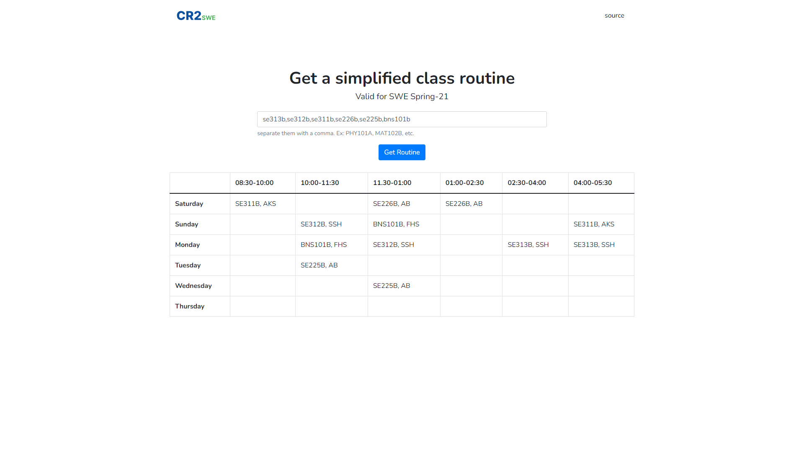

<div align="center">

  
  
  <p>
    A web app that converts the complicated class routine of my university into a simplified one
  </p>

  [Live Demo](https://cr2.zahidtheduck.me/)

</div>

<br>

## About the Project

<!-- Screenshots -->

### Screenshots

<div align="center"> 
  
</div>

### Video Demo
- [CR2 Demo](https://youtu.be/7HjKhImWrzE)

<!-- TechStack -->

### Tech Stack

<ul>
<li><a href="https://reactjs.org/">React</a></li>
<li><a href="https://flask.palletsprojects.com/">Flask</a></li>
<li><a href="https://openpyxl.readthedocs.io/">openpyxl</a></li>
</ul>

<!-- Getting Started -->

## Getting Started

<!-- Prerequisites -->

### Prerequisites

Make sure you have node.js and python 3.8 or above installed

<!-- Run Locally -->

### Run Locally

Clone the project

```bash
  git clone https://github.com/zahid47/CR2.git
```

Go to the backend directory

```bash
  cd cr2/backend
```

Install dependencies

```bash
   pip install -r requirements.txt
```

Start the server

```bash
  export FLASK_APP=app.py
  flask run
```

Open a new terminal and go to the frontend directory

```bash
  cd cr2/frontend
```

Install dependencies

```bash
   yarn install
```

Start the server

```bash
  yarn start
```

<!-- Contact -->

## Contact

scarecow#2857 on discord

<!-- Acknowledgments -->

## Acknowledgements

- [openpyxl](https://openpyxl.readthedocs.io/en/stable/)
- [awesome-readme-template](https://github.com/Louis3797/awesome-readme-template)
